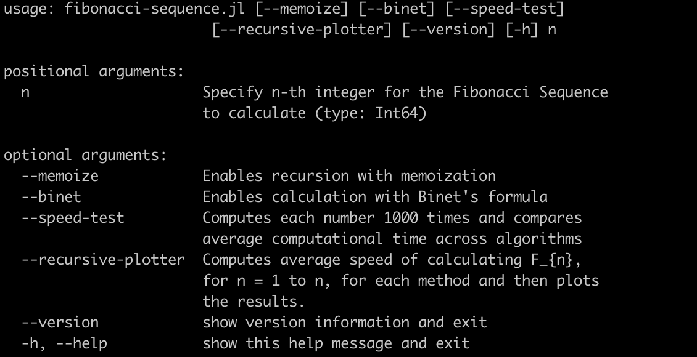

# Fibonacci Sequence Generator

This script can estimate Fibonacci Sequences using three different algorithms and measure their performance. The purpose of this script was to learn programming in Julia. This is a command line tool.

### Required packages
This script requires: ArgParse, BenchmarkTools, and Plots.

These packages can be installed through Julia's builtin package manager (see [https://docs.julialang.org/en/v1/stdlib/Pkg/](https://docs.julialang.org/en/v1/stdlib/Pkg/) for instructions)

```
(@v1.10) pkg> add ArgParse BenchmarkTools Plots
```

### Running the program
```bash
$ julia fibonacci-sequence.jl --help
```

